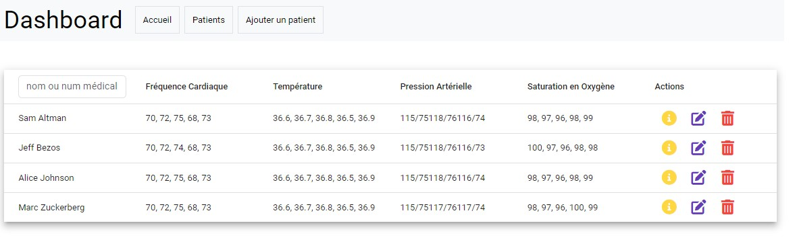
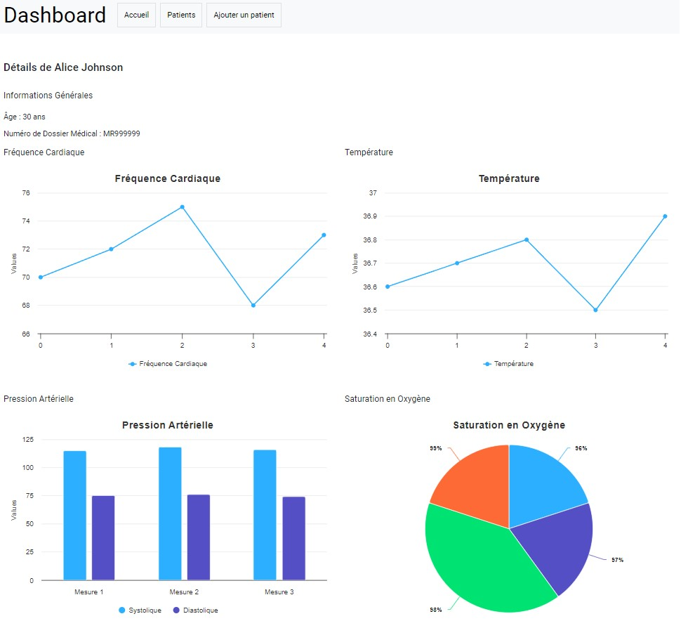

# App to Help Diagnose and Monitor Vascular Diseases

## Backend Spring Boot

### MySQL Configuration
```properties
spring.datasource.url=jdbc:mysql://localhost:3306/diag_vascular_diseases_db?createDatabaseIfNotExist=true&useSSL=false&serverTimezone=UTC
spring.datasource.username=root
spring.jpa.show-sql=true
spring.jpa.hibernate.ddl-auto=update
spring.main.allow-circular-references=true
```

## Frontend Angular

### Homepage



### Patient Details



### Prerequisites

- Node.js
- Angular CLI
- Java Development Kit (JDK)
- Spring Boot

### Getting Started

1. Clone the repository:

   ```bash
   git clone https://github.com/mboup1/app-diag-vascular-diseases.git
   ```

## Development Server

1. **Install Dependencies:**

   - Run `npm install` to install the project dependencies.

2. **Run `ng serve`:**
   - Execute `ng serve --open` to start a dev server and open the application in your default browser. The app will reload if you make any changes to the source files.
